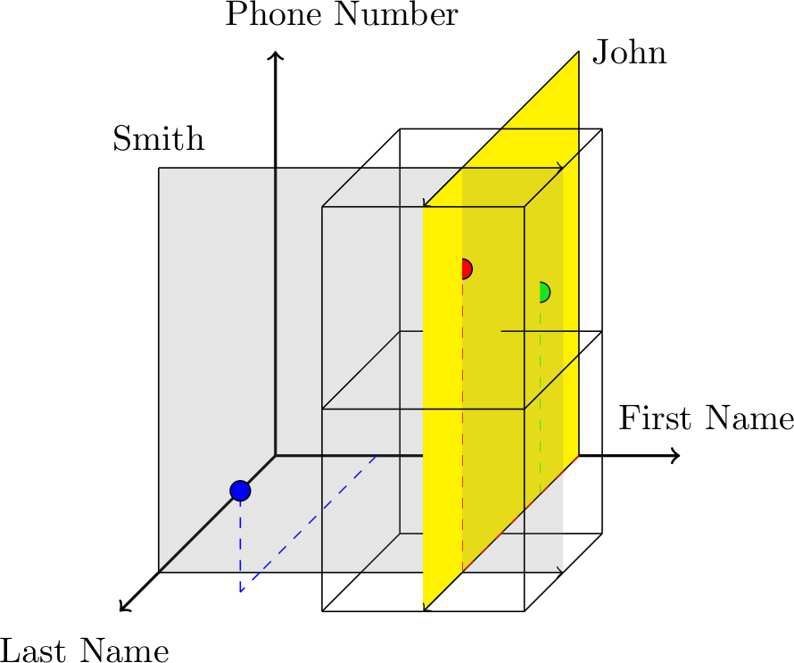
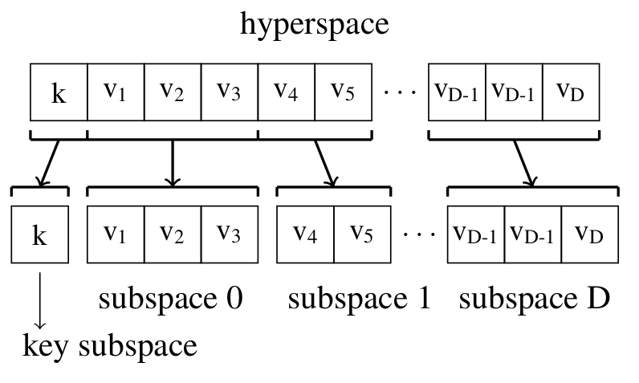

Concepts
========

HyperDex is a distributed, searchable key-value store. The key features of HyperDex are:

 * **Fast**: HyperDex has lower latency, higher throughput, and lower variance than other key-value stores.

 * **Scalable**: HyperDex scales as more machines are added to the system.

 * **Consistent**: HyperDex guarantees linearizability for key-based operations. Thus, it a GET always returns the latest value inserted into the system. Not just "eventually," but immediately and always.

 * **Fault tolerant**: HyperDex automatically replicates data on multiple machines so that concurrent failures, up to an application-determined limit, will not cause data loss.

 * **Searchable**: HyperDex enables lookups of non-primary data attributes. Such searches are implemented efficiently and contact a small number of servers.

A New Approach to NoSQL
-----------------------

HyperDex embodies a unique set of features not found in other NoSQL
systems or RDBMSs. Like many NoSQL systems and unlike traditional
RDBMSs, it provides very high performance and very high
scalability. Yet it does not achieve its high performance by
compromising on consistency. To the contrary, it provides uniquely
strong consistency guarantees while outperforming other NoSQL
systems. Further, HyperDex provides well-defined fault-tolerance
guarantees against both node failures and network partitions. And it
achieves these performance, consistency, availability and fault 
tolerance properties while providing a richer API than most other 
NoSQL stores; specifically, it enables clients to recall objects
using attributes other than the object key. 

HyperDex derives its strong consistency, fault-tolerance and
performance properties from two aspects of its design: hyperspace
hashing, which forms the key organizing principle behind the system,
and value-dependent chaining, a technique for replicating hyperspace
hashed objects to achieve fault-tolerance. Since the latter topic is
entirely invisible to users, we defer its detailed description to the
accompanying white papers, and instead focus on hyperspace hashing in
this document.

Hyperspace Hashing is a new technique for determining how to
distribute objects onto nodes in a cluster. Specifically, it maps
objects with multiple attributes into points in a multidimensional
hyperspace, which has in turn been divided into zones assigned to
servers. Search queries on secondary object attributes can therefore
be mapped to small, hyperspace regions representing the set of
feasible locations for the matching objects. This geometric mapping
enables efficient searches that do not require enumerating across
every object in the system.

The following sections detail how HyperDex places servers and objects
in the Hyperspace, and addresses classic problems with using high dimensional
data-structures. 

Node and Object Placement
-------------------------

HyperDex strategically places objects on servers so that both search and
key-based operations contact a small subset of all servers in the system.
Whereas typical key-value stores map objects to nodes using just the key,
HyperDex takes into account all attributes of an object when mapping it to
servers.

HyperDex uses Hyperspace Hashing to
map objects to points in a multidimensional space.  Hyperspace hashing creates
a multidimensional euclidean space for each table, where a table holds objects
with the same attribute types, and each attribute type corresponds to a
dimension in the euclidean space. HyperDex determines the position of each
object in this space by hashing all of the object's attribute values to
determine a spatial coordinate.

For example a table of objects with "first name", "last name" and "phone
number" attributes corresponds to a three dimensional hyperspace where each
dimension corresponds to one object attribute. Such a space is depicted in the
diagram above. In this space, there exist three objects. The red point is
"John Smith" whose phone number is 555-8000. The green point is "John Doe"
whose phone number is 555-7000. The blue point is "Jim Bob" whose phone number
is 555-2000. Anyone named "John" must map to somewhere in the yellow plane.
Similarly, anyone with the last name "Smith" must map to somewhere within the
translucent plane. Naturally, all people named "John Smith" must map to
somewhere along the line where these two planes intersect.

In each multi-dimnesional space corresponding to a type of object, HyperDex
assigns nodes to disjoint regions of the space, which we call zones. The
example figure shows two of these assignments. Notice that the line for "John
Smith" only intersects two out of the eight zones. Consequently, performing a
search for all phone numbers of "John Smith" requires contacting only two
nodes. Furthermore, the search could be made more specific by restricting it to
all people named "John Smith" whose phone number falls between 555-5000 and
555-9999. Such a search contacts only one out of the eight servers in this
hypothetical deployment.

Subspaces
---------

HyperDex's Euclidean space construction enables geometric reasoning to
significantly restrict the set of nodes that need to be contacted to find
matching objects. However, a naive Euclidean space construction can suffer from
the "curse of dimensionality", as the space exhibits an exponential increase in
volume with each additional secondary attribute. For objects with many
attributes, the resulting Euclidean space would be large, and consequently,
sparse. Nodes would then be responsible for large regions in the hyperspace,
which would increase the number of nodes whose regions intersect search
hyperplanes and thus limit the effectiveness of the basic approach. 

HyperDex addresses the exponential growth of the search space by introducing an
efficient and lightweight mechanism that partitions the data into smaller,
limited-size subspaces, where each subspace covers a subset of object
attributes in a lower dimensional hyperspace.  Thus, by folding the hyperspace
back into a lower number of dimensions, HyperDex can ensure higher node
selectivity during searches.  The figure above shows how HyperDex can represent
a table with ``D`` searchable attributes as a set of subspaces ``s``. 

Data partitioning increases the efficiency of a search by reducing the number of
nodes which must be contacted to perform a search.  For example, consider a
table with 9 secondary attributes.  A simple hyperspace over this whole table
would require 512 zones to provide two regions along each dimension of the
hyperspace.  A search over 3 attributes would need to contact exactly 64 zones.
If, instead, the same table were created with 3 subspaces of 3 dimensions each,
each subspace can be filled with exactly 8 nodes.  A search with no specificity
in this table will need to contact 8 nodes.  A search which specifies all the
attributes in one subspace will contact exactly one node.  If a search includes
attributes from multiple subspaces, it selects the subspace with the most
restrictive search hyperplane and performs the search in that subspace.  Such a
partitioned table provides a worst case bound on the number of server nodes
contacted during a search.

Key Subspace
------------

HyperDex's basic hyperspace construction scheme, as described so far, does not
distinguish the key of an object from its secondary attributes.  This leads to
two significant problems when implementing a key-value store.  First, key
lookups would be equivalent to single attribute searches. Although HyperDex
provides efficient search, a single attribute search in a multi-dimensional
space would likely involve at least two zones.  In this hypothetical scenario,
key operations would be strictly more costly than than key operations in
competing key-value stores. Second, because keys may reside on multiple nodes,
they would not necessarily be unique, which may violate the uniqueness invariant
applications have come to expect from key-value stores.

The preceding data partitioning technique enables a natural way to fix these
issues by creating a dedicated key subspace.  The one-dimensional key subspace
maps each key to exactly one zone in the subspace.  This is because the key
fully specifies the position of the object in the subspace.  To ensure
uniqueness, ``put`` operations are applied to the key subspace before the
remaining subspaces. If an object with the same key already exists, it is
deleted from all subspaces at the same time the new object is being inserted.
By introducing a one-dimensional key subspace, HyperDex provides efficient key
operations and ensures system-wide key uniqueness.

